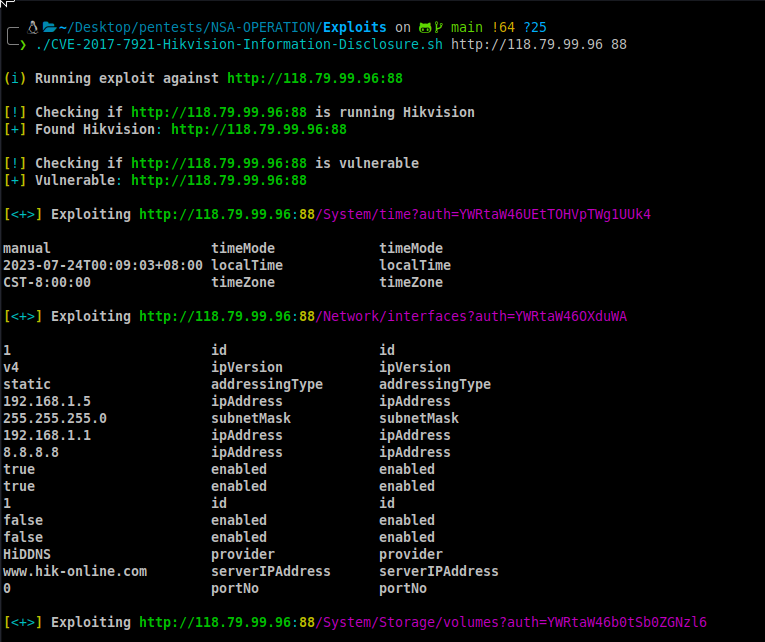
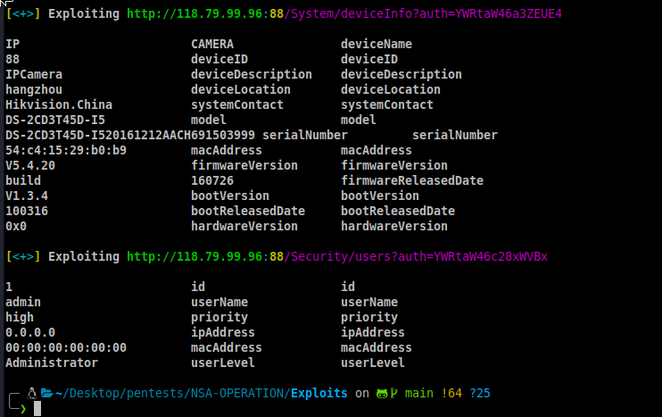

# CVE-2017-7921 - Hikvision Camera Series Improper Authentication Vulnerability

A security flaw identified as CVE-2017-7921, which affects various models of Hikvision cameras. The vulnerability was discovered in the DS-2CD2xx2F-I Series (V5.2.0 build 140721 to V5.4.0 build 160530), DS-2CD2xx0F-I Series (V5.2.0 build 140721 to V5.4.0 Build 160401), DS-2CD2xx2FWD Series (V5.3.1 build 150410 to V5.4.4 Build 161125), DS-2CD4x2xFWD Series (V5.2.0 build 140721 to V5.4.0 Build 160414), DS-2CD4xx5 Series (V5.2.0 build 140721 to V5.4.0 Build 160421), DS-2DFx Series (V5.2.0 build 140805 to V5.4.5 Build 160928), and DS-2CD63xx Series (V5.0.9 build 140305 to V5.3.5 Build 160106) devices.
The flaw identified in the affected Hikvision camera series is an "Improper Authentication" issue. This vulnerability arises when the camera's application does not adequately or correctly authenticate users during the login process. As a result, a malicious user could exploit this weakness to escalate their privileges on the system and potentially gain unauthorized access to sensitive information.

# Screenshots

# Impact

The implications of this vulnerability can be severe, as unauthorized access to camera systems can compromise the security and privacy of users and locations under surveillance. Attackers could exploit this vulnerability to gain unauthorized access to the camera feed, manipulate settings, or even disable the camera, leaving the monitored area vulnerable to intrusion or other malicious activities.

# Exploitation

It's crucial to emphasize that exploiting this vulnerability without proper authorization is illegal and unethical. The "poc exploit" provided in this repository is intended solely for educational purposes, to raise awareness about the potential risks and to facilitate responsible disclosure to Hikvision or other relevant authorities.

# Mitigation

Hikvision has acknowledged this vulnerability and has likely released security patches to address the issue. If you are a user of one of the affected camera series, it is strongly advised to check the Hikvision website or support channels for the latest firmware updates that fix the "Improper Authentication" vulnerability. Regularly updating your camera firmware and other security measures, such as using strong passwords, restricting access to the camera's web interface, and deploying cameras in secure network environments, will further enhance the overall security posture of your surveillance infrastructure.

# Responsible Disclosure

The discovery of this vulnerability is a reminder of the importance of responsible disclosure in the cybersecurity community. Responsible disclosure involves notifying the vendor (in this case, Hikvision) about the identified vulnerability and allowing them sufficient time to release a security patch before public disclosure. This approach ensures that users have access to the necessary updates to secure their systems effectively.

# Conclusion

Understanding and addressing security vulnerabilities in products and systems is a shared responsibility between manufacturers, security researchers, and end-users. By staying informed about potential vulnerabilities and applying timely security updates, we can collectively enhance the security of connected devices and networks. Remember, using exploits for malicious purposes is illegal and can have severe consequences. Let's work together to build a safer digital world.

# Disclaimer

This repository and its content are purely educational and intended to create awareness about cybersecurity. Usage of the provided proof-of-concept exploit for any unauthorized or malicious activities is strictly prohibited. The author cannot be held responsible for any misuse or damage caused by the information provided. Always act responsibly and within the confines of the law.
